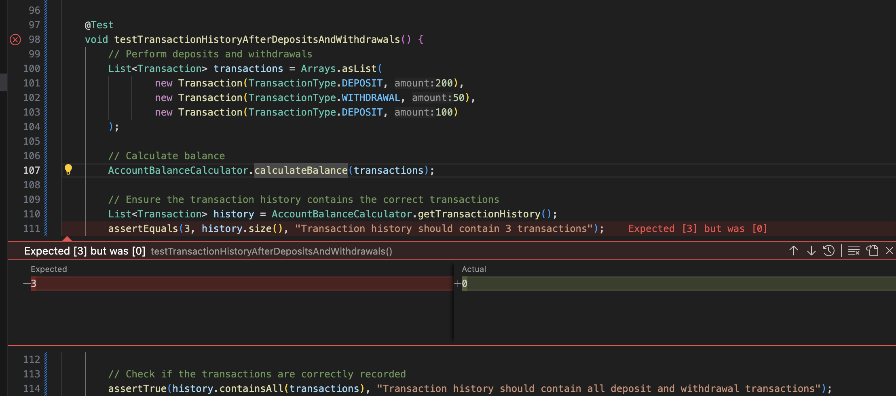
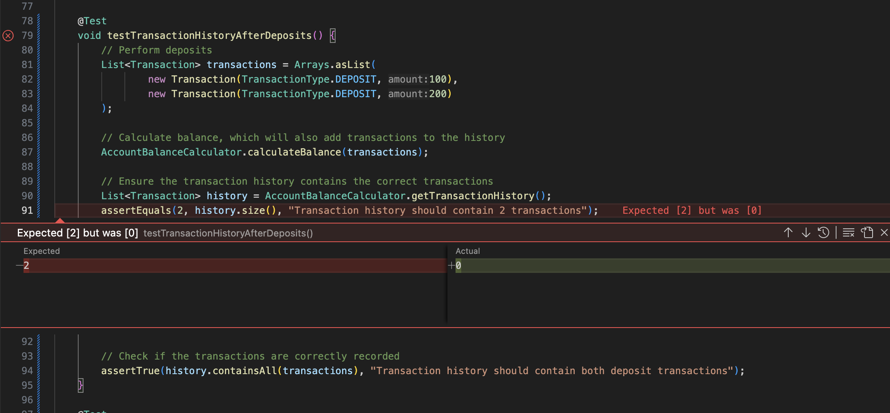
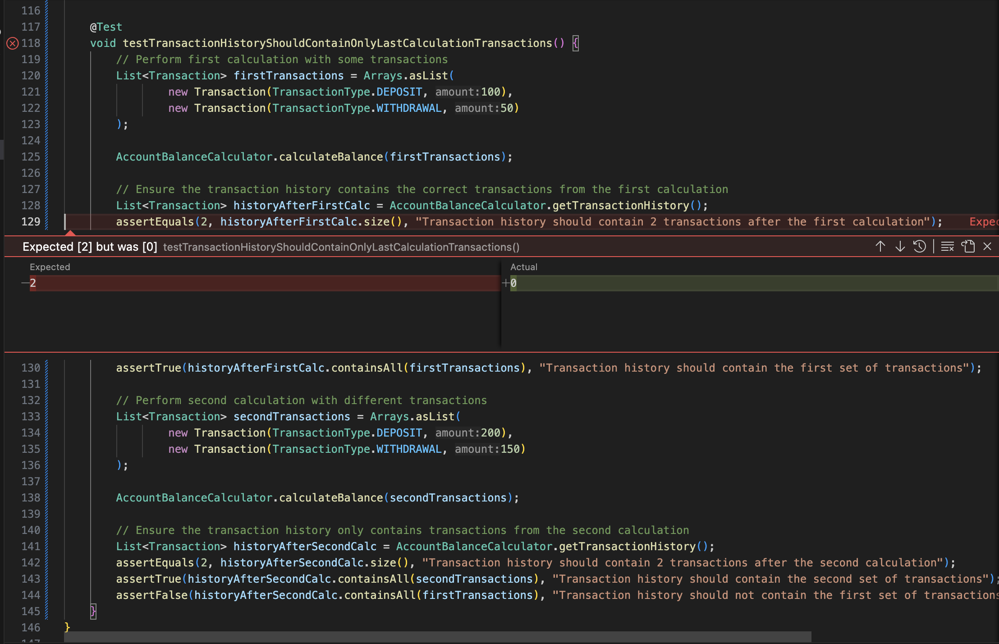
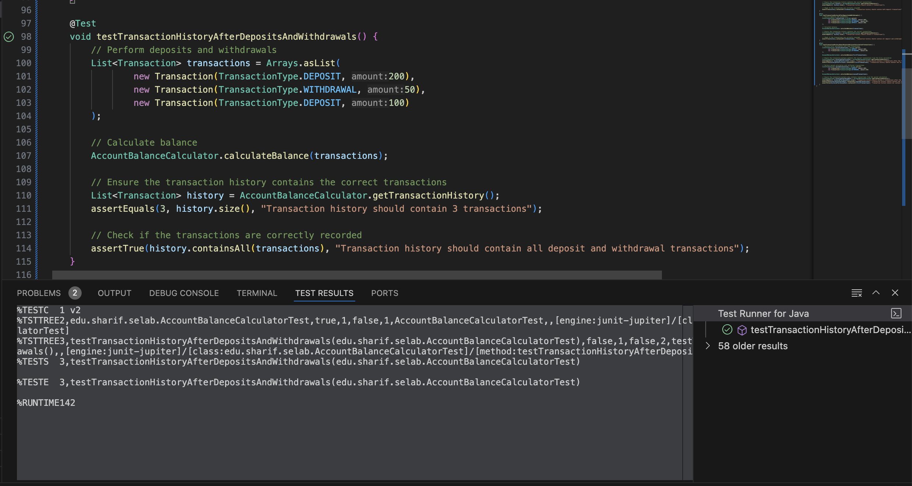
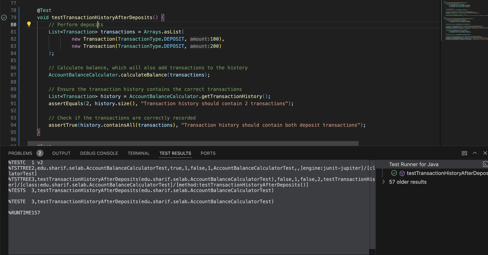
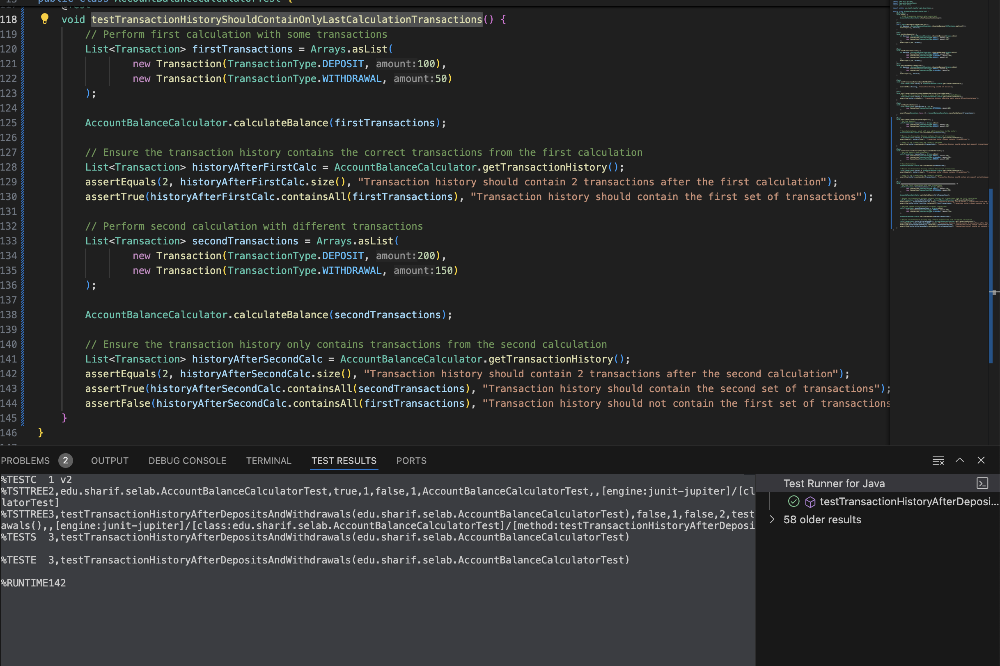

# گزارش آزمایش سوم

## بخش اول

ابتدا تمام تست‌های موجود را اجرا کرده و از پاس شدن آن‌ها مطمئن شدیم:

سپس با دقت در کد و تست‌ها متوجه شدیم که تابعی که با دریافت تراکنش‌ها موجودی را محاسبه می‌کند اجازه می‌دهد که موجودی منفی شود.
بنابراین تست زیر را جهت مطمئن شدن از منفی نشدن موجودی اضافه کردیم:

این تست در ابتدا پاس نمی‌شود زیرا انتظار داریم در صورت منفی شدن موجودی خطایی توسط تابع دریافت کنیم ولی این اتفاق نمی‌افتد.

برای پاس شدن تست، کد تابعی که موجودی حساب را محاسبه میکند به صورت زیر تغییر میدهیم تا تستی که نوشتیم پاس شود. حال این تابع درصورتی که میزان کم شدن از موجودی بیشتر از موجودی باشد اکسپشن پرتاب میکند.

و پس از این تغییر میبینیم که تمامی تست ها مجدد پاس میشوند.

## بخش دوم

در این بخش، بایستی که ابتدا سه تست نهایی و کامنت شده در کلاس AccountBalanceCalculatorTest را از حالت کامنت خارج کنیم. در این حالت مطابق تصاویر زیر مشاهده می‌کنیم که تمامی تست‌های مذکور، فیل می‌شوند. هدف از این بخش شبیه‌سازی بخش اولیه فرایند TDD می‌باشد. پس می‌توان گفت این سه تست عملا نماینده سه فیچر می‌باشند و در گام اول پروسه TDD هستیم. لازم به ذکر است که فیجر مربوط به دو تست اول در راستای سایقه‌ی تراکنش و فیچر تست سوم نیز در راستای نگهداری تنها آخرین تراکنش می‌باشد.

فیل شدن تست testTransactionHistoryAfterDepositsAndWithdrawals

فیل شدن تست testTransactionHistoryAfterDeposits

فیل شدن تست testTransactionHistoryShouldContainOnlyLastCalculationTransactions

حال وارد گام دوم پروسه TDD می‌شویم. در این بخش لازم است کد را به گونه‌ای بازنویسی کنیم که تست‌های فیل شده در گام اول پاس شوند. 

تست‌های مربوط به سابقه تراکنش‌ها (testTransactionHistoryAfterDeposits و testTransactionHistoryAfterDepositsAndWithdrawals): متد calculateBalance حالا تمام تراکنش‌های پردازش‌شده را به transactionHistory اضافه می‌کند. در نتیجه، بعد از محاسبه موجودی با این تراکنش‌ها، سابقه تراکنش‌ها شامل تمام آن‌ها خواهد بود و تست‌ها پاس می‌شوند.

تست مربوط به نگهداری فقط آخرین تراکنش‌ها (testTransactionHistoryShouldContainOnlyLastCalculationTransactions): مهم‌ترین تغییر این است که متد calculateBalance در ابتدای خود، transactionHistory را پاک می‌کند. به همین دلیل:

- در اولین فراخوانی calculateBalance با تراکنش‌های اول، سابقه پاک شده و سپس با آن تراکنش‌ها پر می‌شود. تست‌های مربوط به محتوای سابقه در این مرحله پاس می‌شوند.
در دومین فراخوانی-  calculateBalance با تراکنش‌های دوم، سابقه دوباره پاک شده و با تراکنش‌های دوم پر می‌شود. به این ترتیب، سابقه فقط شامل تراکنش‌های آخرین محاسبه است و تست‌های مربوط به آن پاس می‌شوند.

یا به نوعی می‌توان گفت، با تغییر calculateBalance به طوری که که هم موجودی را محاسبه کند و هم سابقه تراکنش‌ها را (با پاک کردن قبلی و افزودن تراکنش‌های جدید) مدیریت کند، رفتار کلاس AccountBalanceCalculator با نیازمندی‌های تمام تست‌ها هماهنگ شده و این مورد به اجرای موفقیت‌آمیز تست‌ها منجر می‌شود.

ریفکتور و اجرای موفقیت‌آمیز تست‌ها گام نهایی این پروسه می‌باشد. که مطابق تصاویر زیر نهایی شدن پروسه TDD و پاس شدن تست‌ها را مشاهده می‌کنیم:

پاس شدن تست testTransactionHistoryAfterDepositsAndWithdrawals

پاس شدن تست testTransactionHistoryAfterDeposits

پاس شدن تست testTransactionHistoryShouldContainOnlyLastCalculationTransactions

## پاسخ به پرسش‌ها

### پرسش اول
در این کد تابعی که محاسبات مربوط به موجودی را انجام می‌دهد، اجازه می‌دهد موجودی منفی شود.

به نظر می‌رسد دلیل دیده نشده این خطا این باشد که تمامی تست‌های مربوط به این تابع، تابع را با موجودی مثبت یا صفر تست کرده‌اند و حالت‌های خاص در تست‌ها دیده نشده است.

### پرسش دوم
تست مربوط به موچودی منفی اضافه و کد اصلاح شد. فرایند این کار در گزارش موچود است.

### پرسش سوم
 اگر ابتدا کد بزنیم و سپس تست بنویسیم، چون فکر میکتیم تمامی حالات را در نظر گرفته ایم و کد درست و کاملی نوشته ایم، این بایاس ذهنی در تست هایمان دیده خواهد شد.
 در نتیجه ممکن است تست هایی بنویسیم که منطق موجود در برنامه را تایید کنند و نه رفتار مورد انتظار واقعی سیستم را.
 به طور مثال رفتار سیستم را در موارد لبه ای در نظر نگیریم. 
همچنین محتمل است در این صورت کدمان تست پذیر نوشته نشده باشد و برای افزودن تست ها مجبور شویم بازنویسی گسترده ای انجام دهیم. 

### پرسش چهارم
با تعریف کردن تست هایمان پیش از کدنویسی، مشخصات دقیق رفتار مورد انتظارمان از سیستم درهمان ابتدا تعیین میشود و کدها فقط برای پاس شدن این تست ها نوشته میشوند. 
بدین ترتیب هنگام توسعه خطاها بلافاصله بعد از نوشتن کد شناسایی میشوند. 
همچنین باعث میشود کدها ماژولارتر و تمیزتر نوشته شوند.

### پرسش پنجم
به طور کلی بنظر میرسید که پروسه TDD دارای مزایایی زیادی در لایه‌ی فنی می‌باشد. من جمله این مزایا می‌توان به افزایش تمیزی و توسعه‌پذیری کد اشاره کرد. همچنین با توجه به وجود پروسه ریفکتور در ایتریشن‌های TDD کیقیت و خوانایی کد حاصل نیز، بسیار بهتر خواهد بود. به طور کلی و در صورت نگاه کردن به مسئله با عینک فنی، این روش بسیار دلخواه و مناسب است.
از سویی دیگر و با درنظر گرفتن ابعاد دیگر یک محصول، این پروسه دارای معایبی نیز می‌باشد. مشکل اول این روش، کندتر شدن پروسه توسعه (تولید) نرم‌افزار می‌باشد. در بسیاری از مواقع که نیازمندی‌های کسب‌وکاری چابکی را در لایه‌ی فنی ایجاب می‌کند، استفاده از TDD می‌تواند لنگری برای پیشبرد اهداف کسب‌وکاری گردد. همچنین یادگیری و عجین شدن افراد با این پروسه نیز می‌تواند زمان‌بر باشد.

