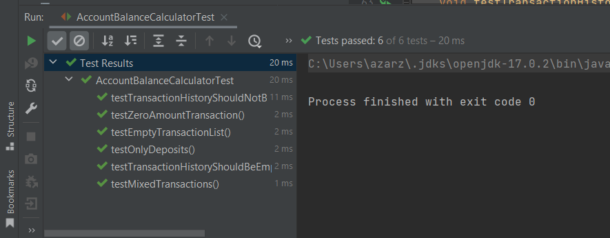
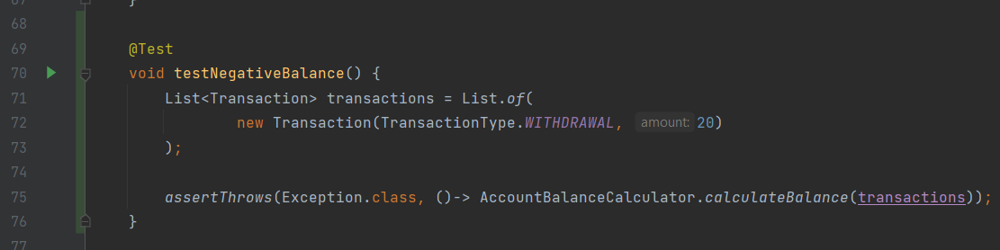
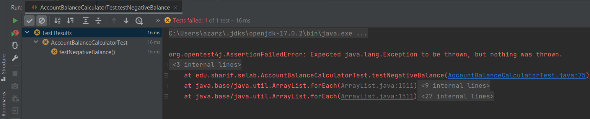
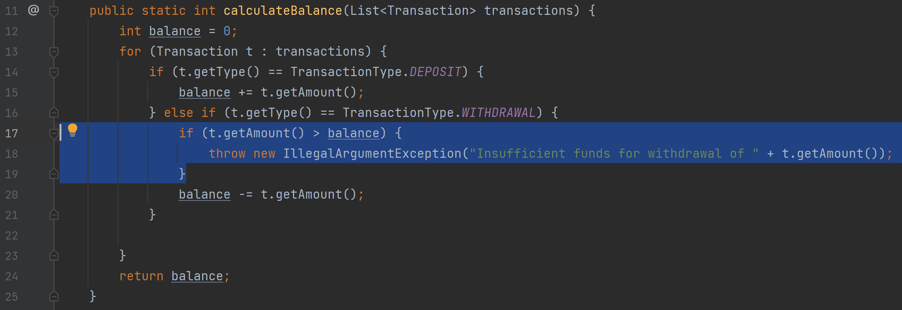
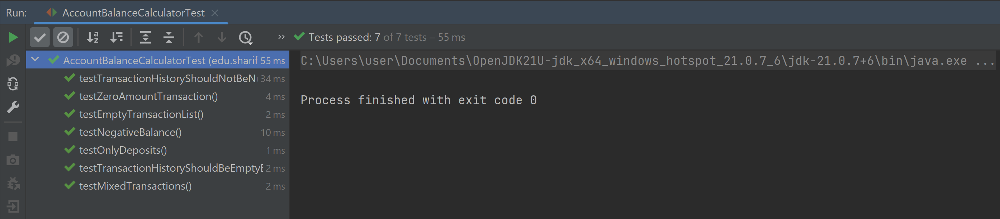

# گزارش آزمایش سوم

## بخش اول

ابتدا تمام تست‌های موجود را اجرا کرده و از پاس شدن آن‌ها مطمئن شدیم:

سپس با دقت در کد و تست‌ها متوجه شدیم که تابعی که با دریافت تراکنش‌ها موجودی را محاسبه می‌کند اجازه می‌دهد که موجودی منفی شود.
بنابراین تست زیر را جهت مطمئن شدن از منفی نشدن موجودی اضافه کردیم:

این تست در ابتدا پاس نمی‌شود زیرا انتظار داریم در صورت منفی شدن موجودی خطایی توسط تابع دریافت کنیم ولی این اتفاق نمی‌افتد.

برای پاس شدن تست، کد تابعی که موجودی حساب را محاسبه میکند به صورت زیر تغییر میدهیم تا تستی که نوشتیم پاس شود. حال این تابع درصورتی که میزان کم شدن از موجودی بیشتر از موجودی باشد اکسپشن پرتاب میکند.

و پس از این تغییر میبینیم که تمامی تست ها مجدد پاس میشوند.

## بخش دوم

## پاسخ به پرسش‌ها

### پرسش اول
در این کد تابعی که محاسبات مربوط به موجودی را انجام می‌دهد، اجازه می‌دهد موجودی منفی شود.

به نظر می‌رسد دلیل دیده نشده این خطا این باشد که تمامی تست‌های مربوط به این تابع، تابع را با موجودی مثبت یا صفر تست کرده‌اند و حالت‌های خاص در تست‌ها دیده نشده است.

### پرسش دوم
تست مربوط به موچودی منفی اضافه و کد اصلاح شد. فرایند این کار در گزارش موچود است.

### پرسش سوم
 اگر ابتدا کد بزنیم و سپس تست بنویسیم، چون فکر میکتیم تمامی حالات را در نظر گرفته ایم و کد درست و کاملی نوشته ایم، این بایاس ذهنی در تست هایمان دیده خواهد شد.
 در نتیجه ممکن است تست هایی بنویسیم که منطق موجود در برنامه را تایید کنند و نه رفتار مورد انتظار واقعی سیستم را.
 به طور مثال رفتار سیستم را در موارد لبه ای در نظر نگیریم. 
همچنین محتمل است در این صورت کدمان تست پذیر نوشته نشده باشد و برای افزودن تست ها مجبور شویم بازنویسی گسترده ای انجام دهیم. 

### پرسش چهارم
با تعریف کردن تست هایمان پیش از کدنویسی، مشخصات دقیق رفتار مورد انتظارمان از سیستم درهمان ابتدا تعیین میشود و کدها فقط برای پاس شدن این تست ها نوشته میشوند. 
بدین ترتیب هنگام توسعه خطاها بلافاصله بعد از نوشتن کد شناسایی میشوند. 
همچنین باعث میشود کدها ماژولارتر و تمیزتر نوشته شوند.